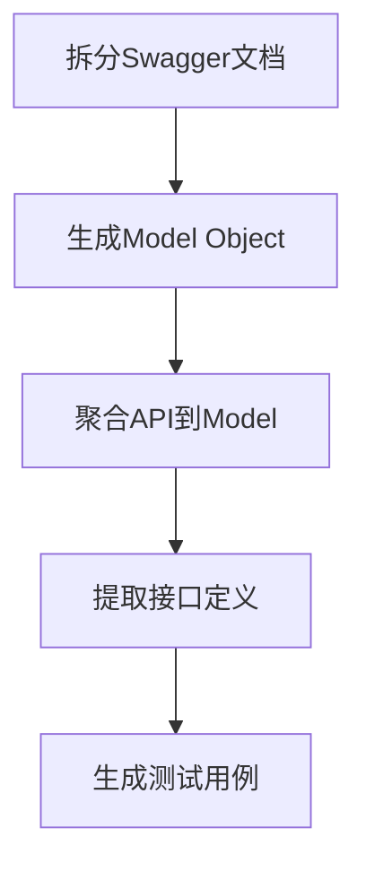

# API 自动化测试框架实践指南

## 结果示例:

* 仅适用于 api 的集成测试, 业务逻辑层面的自动化测试. 大模型不确定的地方标为 todo; 进一步进行人工处理
* 本项目并不是一个开箱即用的工具. 而是一个思路的实践.

```python
def test_all_companies_have_less_than_20_users(client):
    # 步骤1：获取所有公司列表
    companies = Company.get_all(client)

    # 步骤2：遍历每个公司检查用户数量
    for company in companies:
        # 步骤3：获取当前公司的用户列表
        # 使用属性方式获取用户（根据类定义中的@property装饰器）
        # todo: 确认users属性是否自动处理分页返回全部用户
        users = company.users

        # 步骤4：验证用户数量是否符合要求
        assert len(users) <= 20,
            f"Company {company.id} has {len(users)} users, exceeding 20 limit."

# todo: 需要确认Company.get_all()是否返回完整公司列表（处理分页问题）
# todo: 需要确认users属性返回的是完整用户列表还是当前页数据
# todo: 如果存在分页机制，需要添加分页遍历逻辑来获取全部用户
``` 

```python
def test_all_users_in_company_have_unique_avatars(client):
    # 步骤1：获取所有公司
    companies = Company.get_all(client)
    assert companies, "No companies available for testing"

    # 步骤2：遍历每个公司
    for company in companies:
        # 步骤3：获取公司所有用户
        users = company.users  # todo: 确认使用属性是否正确（可能应使用get_users()方法）

        # 步骤4：收集所有用户头像
        avatars = []
        for user in users:
            user_info = user.get_info()
            avatar = user_info.get("avatar")  # todo: 确认头像字段名是否正确（如avatar_url等）
            avatars.append(avatar)

        # 步骤5：验证头像唯一性
        unique_avatars = set(avatars)
        assert len(avatars) == len(unique_avatars),
            f"Company {company.id} has {len(avatars) - len(unique_avatars)} duplicate avatars"
```

## 整体流程图



## 注意事项

⚠️ **重要安全建议** 使用私有化部署的LLM避免数据泄露

## 实施步骤说明

### a. 拆分Swagger文档

* swagger split, 为了减少大模型的幻觉, 减少单次对大模型的输入. 将swagger 文档, 拆成一个个单个 api
  的文档.
* 使用swagger_split.py

```python
# swagger_split.py
name__ == '__main__':
with open(ROOT / 'a_swagger_split/swagger_example.yaml', encoding='utf-8') as f:
    data = yaml.safe_load(f)
output_dir = ROOT / 'output_a_split_APIs'
split_openapi(data, output_dir)
```

**功能说明：**

- 将大型Swagger文档拆分为单个API的独立文件
- 减少LLM处理时的上下文干扰
- 输出目录结构：
  ```
  output_a_split_APIs/
  ├── company_api.yaml
  ├── user_api.yaml
  └── department_api.yaml
  ```

### b. 将每个单独的 API 生成 Model Object

使用api2mod_object.py, 输出示例:

```python
# api2mod_object.py 
class Company(ModObject):

    @classmethod
    def get_all(cls, client) -> list["Company"]:
        """获取全量公司列表"""
        js = client.request("get", "/company", {})
        return [cls(client, x['id'], name=x.get('name'), info=x) for x in js['items']]

    def get_users(self) -> list[User]:
        """从公司info中提取嵌套用户数据并封装User对象"""
        return [User(self.api_client, x['id'], info=x) for x in self.info.get('users', [])]
```

**核心能力：**

- 自动生成面向对象的API操作接口
- 支持嵌套对象自动封装（如User嵌套在Company中）
- 保留原始API响应数据（info属性）

### c. 同一ModelObject 的方法聚合到一个 class 中

group_by_mod_object.py 输出示例:

```python
class Company(ModObject):
    @classmethod
    def create(cls, client) -> "Company":
        data = {}
        js = client.request("post", "/api/v1/company", data)
        return cls(client, id=js['id'], info=js)

    # 其他方法聚合...

    def get_users(self) -> list[User]:
        from
        import User
        response = self.api_client.request("get", f"/company/{self.id}")
        return [User(...) for user in response.get("users", [])]
```

**聚合策略：**

1. 按业务实体（公司/用户）分组API
2. 自动处理跨模块依赖
3. 支持CRUD操作统一封装

### d. 接口定义提取

* 为了生成用例的时候, 减少输入的长度, 抽取mod_object 的 interface.
* 输出示例:

```python
# 提取后的接口示例
class Company(ModObject):
    @classmethod
    def create(cls, client) -> "Company": pass

    @classmethod
    def get_all(cls, client) -> list["Company"]: pass

    def update(self, update_data: dict) -> "Company": pass
```

**提取规则：**

- 保留方法签名和返回类型
- 移除具体实现代码

### e. 测试用例生成

```python
# write_automation_test.py 示例
if __name__ == '__main__':
    cases = [
        {"name": "所有公司的人数不超过20", "desc": "所有公司的人数不超过20"},
        {"name": "每个公司中, 用户的头像都不同", "desc": "每个公司中, 用户的头像都不同"},
    ]
    executor_manager = ExecutorManager(20)
    for case in cases:
        name = case["name"]
        case_desc = case["desc"]
        query = TEMPLATE.replace("#CASE#", case_desc).replace("#INTERFACE_BLOCK#", INTERFACE_BLOCK).replace("#CODE_EXAMPLE#", CODE_EXAMPLE)
        to_save0 = output_case_folder / f"{name}.output.txt"
        if os.path.exists(to_save0):
            continue
        executor_manager.submit(llm_client.ask, query, to_save0)
    executor_manager.results(show_progress=True)
```

**生成策略：**

1. 基于自然语言描述生成测试逻辑
2. 自动添加TODO注释标记潜在问题
3. 输出包含：
    - 断言逻辑
    - 数据验证点

